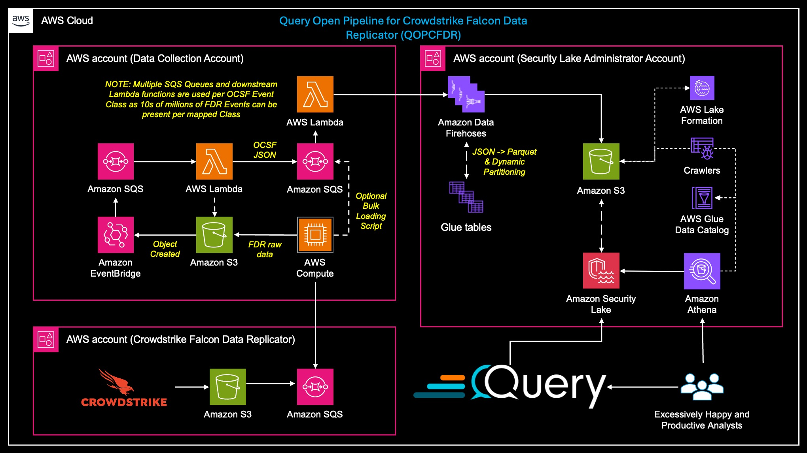
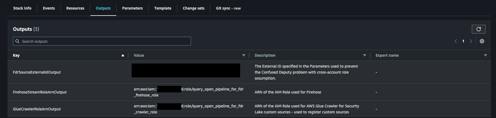
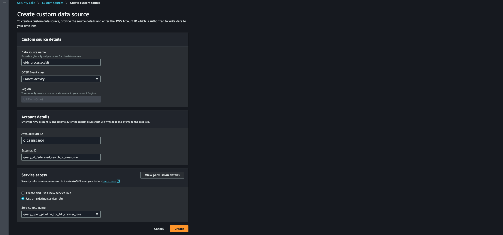
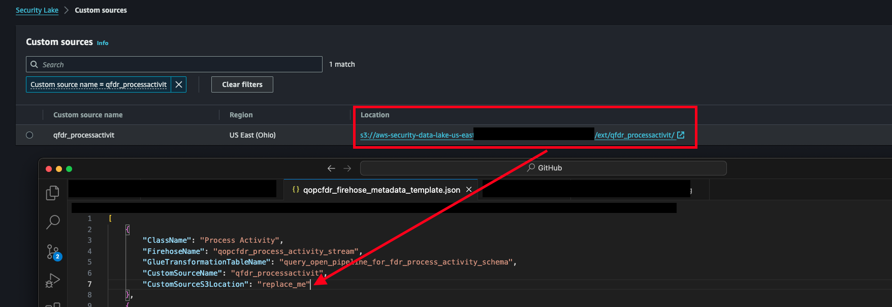
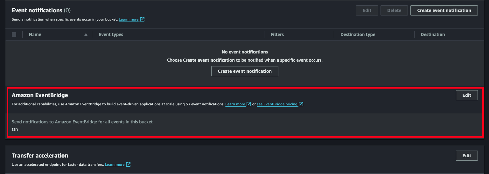

# Query Open Pipeline for Crowdstrike Falcon Data Replicator

Query Open Pipeline for Crowdstrike Falcon Data Replicator (QOPCFDR) is an AWS native data mobility solution for Crowdstrike Falcon Data Replicator ETL into the Amazon Security Lake in OCSF v1.2.0 format.

QOPCFDR facilitates the mobility of streaming (and historical archives) of [Crowdstrike Falcon Data Replicator](https://www.crowdstrike.com/resources/data-sheets/falcon-data-replicator/) (FDR) data. FDR is a mechanism provided by Crowdstrike to: "Collect events in near real time from your Falcon endpoints and cloud workloads, identities and data, enriched by the AI-powered Crowdstrike Security Cloud."

FDR data provides incredibly rich and near real-time sensor-level data as well as other events such as interactions with the Crowdstrike API, identities, and other data points for use by incident response, threat hunting, and detection engineering teams. Crowdstrike provides [a Python script](https://github.com/CrowdStrike/FDR) that will poll your FDR-dedicated [Amazon Simple Queue Service (SQS)](https://aws.amazon.com/sqs/?nc2=h_ql_prod_ap_sqs) queue, download and parse objects containing FDR data from an Amazon S3 bucket, and write it to your own Amazon S3 bucket or local filesystem.

From that point forward is where QOPCFDR serves as an asset. Using Amazon Web Services (AWS) Cloud native services from analytics, application integration, serverless compute, and storage QOPCFDR handles batching, Extraction, Transformation, and Loading (ETL) of raw Crowdstrike FDR data into normalized and standardized [Open Cyber Security Format (OCSF)](https://github.com/ocsf/ocsf-docs/blob/main/Understanding%20OCSF.pdf?extensions=) [version 1.2.0](https://schema.ocsf.io/1.2.0/) and makes it available to the [Amazon Security Lake](https://aws.amazon.com/security-lake/).

As a community project we hope that current consumers of Crowdstrike FDR and/or the Amazon Security Lake find this solution beneficial. Additionally, given the wide breadth of FDR data that come from different operating systems, Crowdstrike licensing tiers, and capture operations - we only have a small snapshot (~120 events) of the nearly 1000 FDR events. We will accept pull requests to improve normalization, to expand mapped events, and share mappings.

## Table of Contents

- [Query Open Pipeline for Crowdstrike Falcon Data Replicator](#query-open-pipeline-for-crowdstrike-falcon-data-replicator)
  - [Table of Contents](#table-of-contents)
  - [Solution Architecture](#solution-architecture)
  - [Prequisites \& Assumptions](#prequisites-assumptions)
  - [Known Limitations](#known-limitations)
  - [Deployment Steps](#deployment-steps)
    - [Prepare the Security Lake Admin Account](#prepare-the-security-lake-admin-account)
      - [Deploying the QOPCFDR SchemaTransformation CFN](#deploying-the-qopcfdr-schematransformation-cfn)
    - [Prepare the the FDR Source Account](#prepare-the-the-fdr-source-account)
  - [Running the Solution \& Cost Estimation](#running-the-solution-cost-estimation)
  - [Providing new Mappings](#providing-new-mappings)
  - [License](#license)

## Solution Architecture



From the bottom-left quadrant, the workflow is as follows:

1. Using the FDR Python script, FDR raw data is written into an Amazon S3 bucket.

2. An [Amazon EventBridge](https://aws.amazon.com/eventbridge/) Rule [monitors the S3 bucket](https://repost.aws/knowledge-center/eventbridge-rule-monitors-s3) for `ObjectCreation` events (Put, Copy, MultiPartUploadComplete) for FDR data being written (only `.gz` files).

3. EventBridge sends the objects to an SQS queue which batches the objects to an [AWS Lambda](https://aws.amazon.com/lambda/?nc2=h_ql_prod_fs_lbd) function.

4. The first Lambda function will parse and normalize the raw FDR data into JSON format, and send specific events to the appropriate upstream SQS queues based on the mapping of an FDR event to an [OCSF Class](https://schema.ocsf.io/1.2.0/classes?extensions=).

5. These subsequent SQS Queues batch up transformed data to Lambda functions which write into batches to dedicated [Amazon Data Firehose](https://aws.amazon.com/firehose/) Delivery Streams.

6. Data Firehose transforms the JSON data into [Parquet](https://parquet.apache.org/) format using schemas stored in [AWS Glue](https://aws.amazon.com/glue/) tables, and dynamically partitions the data in an appropriate format for Security Lake.

7. Each Firehose writes the GZIP-compressed Parquet data into [partitions](https://aws.amazon.com/blogs/big-data/get-started-managing-partitions-for-amazon-s3-tables-backed-by-the-aws-glue-data-catalog/) within a specific S3 location that matches an Amazon Security Lake Custom Source.

8. End-users can query the FDR Security Lake tables using [Amazon Athena](https://aws.amazon.com/athena/) - a [Trino](https://trino.io/)-based serverless analytics engine - or by using [Query.ai's Federated Search](https://www.query.ai/) platform.

9. Your analysts are very happy to use FDR data!

All services except for the Amazon Security Lake Custom Sources (and supporting ancillary services which are auto-created/auto-invoked) are deployed using AWS CloudFormation stacks. Refer to the [Prequisites & Assumptions](#prequisites--assumptions) and [Known limitations](#known-limitations) sections for information about what you need to do, and limitations around QOPCFDR, respectively.

## Prequisites & Assumptions

- You have at least Python 3.10.4 and `pip3` (or your favored package manager) installed locally.

- You have the AWS CLI configured on your local workstation, server, etc.

- Crowdstrike Falcon Data Replicator is enabled in your tenant.

- You use Crowdstrike's Python script for writing FDR data to Amazon S3.

- You have Security Lake enabled in at least one Account and Region.

- You have a separate security data collection account from your Security Lake Delegated Administrator, while this solution *can* work, additional Lake Formation permissions issues may arise that have not been tested..

- You have Admin access to your data collection and Security Lake account and can interact with various APIs from Lake Formation, Glue, S3, IAM, Firehose, SQS, and more.

- You understand limits around Kinesis Data Firehose and that ***you will be throttled*** if you attempt to replay 10TB worth of data.

- **YOU DO NOT CHANGE ANY HARD CODED NAMES!** To streamline deployment, a lot of names are hardcoded to avoid complex interpolation logic or repeated manual data entry (such as giving the wrong Firehose or SQS Queue name to the wrong Lambda function).

## Known Limitations

- This is a Security Lake-only integration, in the future we may expand to other Lakehouses using open source data orchestration projects.

- There is no utility to bulk-move previously saved FDR data. The best mechanism is to copy existing and future FDR dumps into a new bucket and key the automation off of it. In the future we are considering developing an EMR Notebook to utilize PySpark for petabyte scale mobility into the Security Lake.

- Only 122 out of 950+ Falcon Data Replicator event types are supported due to the size and scope of our environment. Nearly every Windows events and mobile events are missing. Advanced licensing data is missing from FDR as well. Please see the **Expanding Coverage** section for more information on contributing mappings or providing us data.

- Only the raw FDR events are normalized, other structured data from `aidmaster` and `manageddevice` is **NOT NORMALIZED NOR USED**.

- Not every potential normalization is known, and the normalization is written against OCSF v1.2.0.

- Simplistic exponential backoff built into Boto3 and Python is used for moving data between services - there can be times (depending on volume) where Firehose is throttled - Dead Letter Queues (DLQ) and more resilient retry logic will be developed at a later date.

## Deployment Steps

### Prepare the Security Lake Admin Account

The following steps must take place in the AWS Account where Amazon Security Lake is deployed. For the best configuration, deploy this into the (Delgated) Administrator account in your primary or "home" Roll-Up Region where all other Security Lake data flows.

#### Deploying the QOPCFDR SchemaTransformation CFN

1. Deploy the [`QOPCFDR_SchemaTransformation_CFN.yaml`](./src/cfn_yaml/QOPCFDR_SchemaTransformation_CFN.yaml) CloudFormation stack. This Stack deploys Glue Tables used by Firehose to translate JSON OCSF to Parquet, deploys necessary IAM Roles, and applies LakeFormation permissions to the Roles.

    Automating the deployment of this CloudFormation is outside the scope of this document. To manually deploy the template:

    - Download `QOPCFDR_SchemaTransformation_CFN.yaml`
    - Open the AWS Console -> CloudFormation -> Stacks -> Create Stack
        - Choose an existing template
        - Upload a template file
        - Choose the `QOPCFDR_SchemaTransformation_CFN.yaml` file you downloaded previously and click `Next`

    You will be prompted to input CloudFormation Stack Parameters:

    - FdrSourceAccountId: The FDR Source Account ID.  This is the account that processes your CloudStrike logs
    - FdrSourceExternalId: Enter a value to use for External ID.  This value is used by the FDR Source Account during role assumption.  [Read more about External ID's here](https://docs.aws.amazon.com/IAM/latest/UserGuide/id_roles_create_for-user_externalid.html).
    - You can input any value you like here or generate a value.  ex: using a [short unique ID (uuid) generator](https://shortunique.id/)
    - GlueServiceRolePolicy: Do not change this value
    - SecLakeDatabaseName and SecLakeS3BucketName.
    - Via the Console - AWS Glue -> Databases or
    - By using the CLI:

        ```shell
        aws glue get-databases
        ```

        This will retrieve all of the glue databases in your account.  You *probably* want the one prefixed `amazon_security_lake_glue_db_{your_region}`.

        Example output: (your output may be a different region)

        ```json
        {
            "DatabaseList": [
                {
                    "Name": "amazon_security_lake_glue_db_us_east_1",
                    "LocationUri": "aws-security-data-lake-us-east-1-9kFE3mYt71Fg0AxQClO5jPmLtQLhgz",
                    "CreateTime": "2023-07-12T06:50:00-05:00",
                    "CreateTableDefaultPermissions": [],
                    "CatalogId": "123456789012"
                }
            ]
        }
        ```

        The value for `SecLakeDatabaseName` is `DatabaseList[0].Name`

        The value for `SecLakeS3BucketName` is `DatabaseList[0].LocationUri`

    - Click `Next`
    - Set the tags, retention policy, etc per your organizations standard
    - Deploy the stack!

2. In the output of the Stack, copy all three of the ARNs for the Roles, as they will be needed in future steps as shown below. The immediate one that is needed is the Glue Crawler ARN. This has Lake Formation permissions and IAM permissions to crawl the FDR data written to the Security Lake S3 Bucket.

    

3. Manually create Custom Sources using the Custom Source Name and Class Name detailed in [`qopcfdr_firehose_metadata.json`](./src/json/qopcfdr_firehose_metadata.json) as shown, and detailed, below. As of 7 JUNE 2024 you will need to manually create 13 Custom Sources.

    - Data source name: from `CustomSourceName`.  **Note** that some of the names are intentionally truncated to 20 otherwise the IAM role created is to long.
    - OCSF Event class: from `ClassName`. **Note** that `Operating System Patch State` appears as `Patch State` in Security Lake.
    - AWS Account ID: Enter your current account, this will create a dedicated IAM Role that allows s3:PutObject permissions. QOPCFDR uses Firehose so you can safely ignore these. *DO NOT DELETE THEM* or you will break Custom Sources.
    - External ID: Enter anything here.  This is the external id used for the iam role created for this source.  It is not needed for the Query Open Pipeline.
    - Service Access: Select **Use an exisitng service role** and choose the Crawler Role deployed in Step 1. This will be named `query_open_pipeline_for_fdr_crawler_role`.

    

4. Copy the the full S3 URI (including `s3://` and the trailing `/`) back into the JSON file as shown below. this file will be used by a script in the following steps that will create the Firehose Delivery Streams. This is also why we could not create the Firehose resources in the CloudFormation template.

    

5. Run the `create_qopcfdr_firehoses.py` script, providing an argument of the Firehose Role name (this should be `FirehoseStreamRoleArnOutput` from the initial CFN deployment) and optionally the location of the metadata JSON if it is not in your current working directory. This will create Firehose Delivery Streams that use the Glue tables and the IAM Role from the Stack deployed in Step 1.

- 5A: You will require the following IAM Permissions

```js
logs:CreateLogGroup
firehose:CreateDeliveryStream
firehose:ListDeliveryStreams
firehose:DeleteDeliveryStream
```

- 5B: Refer to the following commands to create a virtual environment, install necessary dependencies, and run the script.

```bash
# for macos
export AWS_ACCOUNT_ID="your_account_id"
brew install python3
pip3 install virtualenv
cd /Documents/GitHub/query_open_pipeline_for_crowdstrike_falcon_data_replicator
virtualenv -p python3 .
source ./bin/activate
pip3 install boto3 --no-cache
pip3 install argparse --no-cache
python3 ./src/python/create_qopcfdr_firehoses.py --firehose_role_arn arn:aws:iam::${AWS_ACCOUNT_ID}:role/query_open_pipeline_for_fdr_firehose_role --firehose_metadata_file_name ./src/json/qopcfdr_firehose_metadata.json --deployment_mode create
```

To rollback the Firehose Delivery Streams, re-run the script without any arguments using `--deployment_mode delete`. It will keep the CloudWatch Log Group.

You have completed setup in the Security Lake Account, now change to your Data Collection AWS account where Crowdstrike FDR data is written to complete the setup.

### Prepare the the FDR Source Account

**IMPORTANT NOTE**: This solution has not been tested within one Account, proceed at your own risk if you attempt to deploy the rest of the solution into the (Delegated) Administrator Security Lake Account.

6. In the AWS Console navigate to **Services** -> **Storage** -> **S3**. In the S3 Console, create a bucket (or locate the existing one) for your Crowdstrike FDR data. In the **Properties** tab, scroll to the **Amazon EventBridge** section and enable the `Send notifications to Amazon EventBridge for all events in this bucket` option by using **Edit** as shown below.



**NOTE**: It is recommended to create a new one if you are currently writing to a bucket that has `.gz` data written to it or uses a nested structure. This way you can safely copy existing FDR data and not risk transient failures from the QOPCFDR infrastructure being invoked for mismatched data.

7. Upload [`QFDR_OCSF_Mapping.json`](./src/json/QFDR_OCSF_Mapping.json), [`mapped_qfdr_events_to_class.json`](./src/json/mapped_qfdr_events_to_class.json), [`qopcfdr_stream_loader.py`](./src/python/qopcfdr_stream_loader.py) (**ZIP THIS BEFORE UPLOADING!**) into another S3 bucket - or use the same Bucket. These are artifacts needed to create the streaming Lambda function and contain `base_event` normalizations and Crowdstrike FDR to OCSF Class mappings.

```bash
# zip the qopcfdr_stream_loader.py file
cd src/python
zip ../../qopcfdr_stream_loader.zip qopcfdr_stream_loader.py
```

```bash
ARTIFACT_BUCKET_NAME="my_bucket_name"
aws s3 cp src/json/QFDR_OCSF_Mapping.json s3://${ARTIFACT_BUCKET_NAME}/QFDR_OCSF_Mapping.json
aws s3 cp src/json/mapped_qfdr_events_to_class.json s3://${ARTIFACT_BUCKET_NAME}/mapped_qfdr_events_to_class.json
aws s3 cp qopcfdr_stream_loader.zip s3://${ARTIFACT_BUCKET_NAME}/opcfdr_stream_loader.zip
```

**NOTE**: In the future, as QOPCFDR expands mappings, you will need to re-upload these artifacts and redeploy the Stack from Step 1 to take advantage of new normalizaiton and mappings.

8. Deploy the [`QOPCFDR_DataCollectionSupport_CFN.yaml`](./src/cfn_yaml/QOPCFDR_DataCollectionSupport_CFN.yaml) Stack. This stack creates an EventBridge Rule, SQS Queues, Lambda functions, and IAM roles that facilitate the batching and queueing of FDR data from its raw form into the Security Lake.

You are now ready to begin streaming Falcon Data Replicator data into the Amazon Security Lake. 

## Running the Solution & Cost Estimation

To peform a basic benchmark, consider copying some existing FDR data into the bucket designated in Step 6 of the setup.

Longer term, consider using a containerized ECS Service (or otherwise) that runs the Crowdstrike FDR script. By default it will long-poll the FDR SQS queue looking for new events. By keeping this middleware constantly running you can help ensure there will not be any throttling, dropped, or duplicate records written into the Security Lake.

At a high-level here are some cost considerations using `us-east-2` (Ohio) as a comparison.
- Firehose: $0.031/GB - this drops to $0.27/GB after the first 500TB/month.
- Firehose JQ Processing: $0.07/Hour in total. In our testing ~600ms per 500 record batch was required.
- Amazon S3 Storage: $23/TB/Month in Standard Availability (S3)
- Amazon SQS: $0.40/1M Request for the first 100B Requests. These requests will come in the form of every FDR object uploaded and every FDR record written to the various Queues.
- AWS Lambda Compute: $0.0000166667/GB-Seconds, this works out to $0.005/invocation that takes the full 300 seconds before timing out. Lambdas will process 500 records (or whatever you set your batch size to) per Queue.
- AWS Lambda Requests: $0.20/1M Requests.

If you are processing 50TB/month of FDR data, and if every TB has 10M records, an estimate cost would be ~$2775/Month before discounts and credits.
- $1150 S3 cost for SA storage.
- $1550 Firehose Costs + $12.60 for 120hrs of JQ processing.
- $10 SQS costs - figuring 25M messages (each message is played twice, or more depending on long polling).
- $5 Lambda Request costs - figuring 10M records.
- $58 Lambda compute costs - figuring average 70 GB-seconds per Invocation at $0.00116 for that duration and 50000 invocations per month.

There are harder cost facts to figure such as Glue, which charges $1/1M requests after the first 1M. There is also $1/100K objects recorded in the catalog after the first 1M objects. Athena charges are $5/TB scanned if you are using it to query your FDR data.

## Providing new Mappings

*coming soon* - we are working on a script that will create a differential of mapped data and provided samples that you can submit in an Issue.

## License

Licensed under Apache-2.0. See the license file [here](./LICENSE).